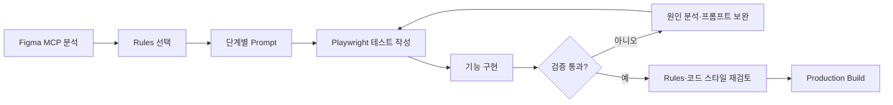

# Emotion Diary

> **AI에게 단순히 코딩만 맡긴 것이 아닌, AI가 안정적으로 일할 수 있는 개발 시스템을 설계한 개인 프로젝트입니다.**

Cursor AI와 Figma MCP를 활용해 기획된 디자인을 실제 서비스로 구현하고, Cursor Rules·재사용 프롬프트·Playwright 테스트·최종 빌드 검증으로 결과를 통제했습니다.  
단순한 코드 생성 속도보다 **AI에게 정확한 맥락과 제약을 제공하고, 결과를 검증하며, 실패를 다시 개발 프로세스에 반영하는 역량**을 증명하는 것이 이 프로젝트의 목적입니다.

---

생성형 AI를 활용하면 코딩은 압도적으로 빠르지만 실제 개발에서는 다음 문제가 더 중요하다고 생각합니다.

1. AI가 기존 구조를 무시하고 예상하지 못한 파일까지 수정하지 않는가?
2. 여러 작업을 동시에 진행해도 코드 충돌과 맥락 손실을 통제할 수 있는가?
3. Figma 디자인을 임의로 해석하지 않고 일관된 UI로 구현할 수 있는가?
4. 생성된 코드가 실제 요구사항을 만족하는지 테스트와 빌드로 증명할 수 있는가?

Emotion Diary에서는 이 문제를 **Rules → Prompt → Test → Review → Build**의 반복 가능한 개발 프로세스로 해결했습니다.

| 구분             |  규모 | 위치                                                 | 의미                                                       |
| ---------------- | ----: | ---------------------------------------------------- | ---------------------------------------------------------- |
| Cursor Rules     |  12개 | [`.cursor/rules`](./.cursor/rules)                   | AI의 수정 범위, 코드 스타일, 테스트, 최종 검수 기준 정의   |
| 재사용 프롬프트  |  72개 | [`src/**/prompts`](./src)                            | 화면·기능을 단계별 작업 단위로 분리하고 요구사항을 문서화  |
| Playwright 스펙  |  21개 | [`src/**/tests`](./src)                              | 사용자 행동과 권한 분기를 브라우저 환경에서 검증           |
| 테스트 시나리오  | 138개 | [`*.spec.ts`](./src)                                 | 검색, 필터, CRUD, 인증, 라우팅 등 요구사항을 테스트로 명세 |
| Storybook 스토리 |   7개 | [`src/commons/components`](./src/commons/components) | 공통 UI를 페이지와 분리해 독립적으로 확인                  |

## AI 활용 전략

### 1. Figma MCP로 디자인 맥락 전달

Figma MCP를 통해 화면의 크기, 간격, 계층 구조를 AI가 직접 분석하도록 했습니다. 이후 한 번에 완성 화면을 요청하지 않고 다음 순서로 나누어 구현했습니다.

`Figma 분석 → HTML/CSS 뼈대 → UI 디테일 → 반응형 → 기능 연결`

- Figma에 정의된 수치와 에셋을 우선 사용
- 기존 HTML/CSS 구조를 유지하며 내부 UI만 교체
- CSS Modules와 Flexbox로 구현 방식을 제한
- 공통 컴포넌트를 먼저 분리해 화면 간 일관성 확보

이 방식은 AI가 디자인을 자의적으로 확장하거나, 화면마다 서로 다른 구현 패턴을 만드는 문제를 줄였습니다.

### 2. Cursor Rules를 코드 생성의 가드레일로 사용

프롬프트마다 반복해서 설명해야 하는 원칙을 `.cursor/rules`로 분리했습니다.

| Rule                                                   | 통제하는 항목                                                          |
| ------------------------------------------------------ | ---------------------------------------------------------------------- |
| [`01-common.mdc`](./.cursor/rules/01-common.mdc)       | 지정 파일 외 수정 금지, 임의 라이브러리 설치 금지, 기존 구조 우선 분석 |
| [`02-wireframe.mdc`](./.cursor/rules/02-wireframe.mdc) | CSS Modules, Flexbox, 전역 스타일 변경 제한                            |
| [`03-ui.mdc`](./.cursor/rules/03-ui.mdc)               | Figma 수치 준수, 프로젝트 에셋 재사용                                  |
| [`04-func.mdc`](./.cursor/rules/04-func.mdc)           | Hook 책임 분리, React Query, React Hook Form, Zod, Playwright 기준     |
| [`05-func.role.mdc`](./.cursor/rules/05-func.role.mdc) | 로그인·비로그인 사용자 권한 분기 테스트                                |
| [`recheck.*.mdc`](./.cursor/rules)                     | 규칙, 코드 스타일, 공통 컴포넌트, 전체 테스트, 빌드 재검토             |

Rules는 AI에게 단순한 코딩 스타일이 아니라 **작업 권한과 완료 조건**을 전달하는 장치로 사용했습니다.

### 3. 프롬프트를 재사용 가능한 개발 명세로 관리

프롬프트는 채팅 기록에만 남기지 않고 구현 코드와 같은 디렉터리에 저장했습니다.

```text
prompt.101.wireframe.txt             # 구조와 레이아웃
prompt.201.ui.txt                    # Figma 기반 UI
prompt.202.ui.responsive.*.txt       # 반응형 기준
prompt.301.func.*.txt                # 기능과 테스트
prompt.302.func.*.txt                # 데이터 바인딩·후속 기능
```

각 프롬프트에는 다음 정보를 명시했습니다.

- 적용할 Cursor Rules
- 수정하거나 참고할 파일의 정확한 경로
- 구현 요구사항과 금지사항
- 사용자 시나리오와 테스트 조건
- 작업 종료 후 반환할 체크리스트

예를 들어 검색 기능은 “검색 기능을 만들어줘”라고 요청하지 않았습니다.  
데이터 형태, 검색 조건, 사용자 행동, 테스트 식별자, 수정 가능한 Hook과 테스트 파일까지 지정했습니다.  
이를 통해 프롬프트를 **재현 가능한 작업 명세서**로 만들었습니다.

### 4. 충돌 가능한 작업과 병렬 가능한 작업을 구분

Cursor의 병렬 작업은 빠르지만, 같은 파일이나 공통 상태를 동시에 수정하면 결과의 신뢰도가 낮아집니다.  
따라서 작업을 다음 기준으로 분리했습니다.

- 서로 다른 Hook과 테스트 파일은 병렬 처리
- 공통 컴포넌트와 전역 설정 변경은 순차 처리
- 병렬 작업 중에는 전체 테스트와 빌드를 실행하지 않도록 제한
- 각 작업에 수정 가능한 파일 경로를 명시
- 병합 후 전체 테스트와 빌드를 한 번 더 실행

AI의 병렬성을 무조건 사용하는 대신 **의존성과 충돌 범위를 판단해 작업을 배치하는 것**도 개발자의 역할이라고 판단했습니다.

### 5. 테스트와 재검토를 완료 조건으로 설정

AI의 응답이나 체크리스트만으로 작업을 완료 처리하지 않았습니다.



- 기능 구현 전 사용자 시나리오를 Playwright 테스트로 작성
- CSS Module 해시와 충돌하지 않도록 `data-testid` 사용
- API, 라우팅, 인증 여부를 포함한 실제 브라우저 흐름 검증
- Storybook으로 공통 컴포넌트를 페이지와 독립적으로 확인
- 재검토 전용 Rules로 누락된 조건과 스타일 일관성 확인
- 마지막에 `npm run build`로 컴파일, lint, type check, 정적 페이지 생성을 검증

## AI를 통제한 구체적인 방법

| AI 활용 시 발생할 수 있는 문제 | 적용한 통제 방식                                      | 저장소의 증거                                                                               |
| ------------------------------ | ----------------------------------------------------- | ------------------------------------------------------------------------------------------- |
| 관련 없는 파일까지 수정        | 수정 가능 경로와 금지사항을 프롬프트에 명시           | [`prompt.303.func.search.txt`](./src/components/diaries/prompts/prompt.303.func.search.txt) |
| 화면마다 다른 스타일 생성      | CSS Modules·Flexbox 규칙과 공통 컴포넌트 우선         | [`02-wireframe.mdc`](./.cursor/rules/02-wireframe.mdc)                                      |
| Figma를 임의로 재해석          | 디자인 수치·에셋·구현 순서를 Rule로 고정              | [`03-ui.mdc`](./.cursor/rules/03-ui.mdc)                                                    |
| 기능은 동작하지만 회귀 발생    | 사용자 시나리오 기반 Playwright 테스트                | [`diaries/tests`](./src/components/diaries/tests)                                           |
| 인증 상태에 따른 예외 누락     | 로그인·비로그인 Guard 시나리오 분리                   | [`auth.guard.hook.tsx`](./src/commons/providers/auth/auth.guard.hook.tsx)                   |
| 병렬 작업 간 코드 충돌         | 파일 단위 책임 분리와 전체 검증 시점 통제             | [`hooks`](./src/components/diaries/hooks)                                                   |
| AI가 완료했다고 잘못 판단      | recheck Rules와 production build를 최종 조건으로 사용 | [`recheck.401.required.final.mdc`](./.cursor/rules/recheck.401.required.final.mdc)          |

## 주요 기능

### Diary

- 일기 목록 조회, 검색, 감정 필터, 페이지네이션
- 일기 작성, 상세 조회, 수정, 삭제
- 일기별 회고 작성, 조회, 수정, 삭제
- 반응형 UI와 라이트·다크 테마

### Authentication

- Supabase 기반 회원가입·로그인·로그아웃
- 로그인 상태에 따른 페이지와 액션 권한 분기
- React Hook Form과 Zod를 활용한 입력 검증

### Pictures

- 이미지 목록 조회와 추가 로딩
- 기본형·가로형·세로형 비율 필터
- API 상태와 UI 상태를 분리한 데이터 바인딩

## 기술적 설계

```text
src/
├─ app/                       # Next.js App Router, 페이지, API Route
├─ components/                # 도메인 단위 UI·Hook·Prompt·Test
│  ├─ auth-login/
│  ├─ auth-signup/
│  ├─ diaries/
│  ├─ diaries-detail/
│  ├─ diaries-new/
│  └─ pictures/
└─ commons/
   ├─ components/             # Storybook으로 검증하는 공통 UI
   ├─ constants/              # URL, color, typography, enum
   ├─ layout/
   └─ providers/              # Auth, Modal, Theme, React Query
```

- 페이지는 조립과 라우팅에 집중하고, 기능은 도메인 Hook으로 분리했습니다.
- 서버 상태는 TanStack Query, 폼 상태는 React Hook Form, 스키마 검증은 Zod로 책임을 구분했습니다.
- URL과 enum을 상수화해 AI가 문자열을 임의로 하드코딩하지 않도록 했습니다.
- Modal은 Portal 기반 Provider로 관리하고, 인증·테마·데이터 Provider는 Root Layout에서 조합했습니다.

## Tech Stack

| 영역              | 기술                               |
| ----------------- | ---------------------------------- |
| Framework         | Next.js 14, React 18, TypeScript   |
| Styling           | CSS Modules, Tailwind CSS          |
| Server State      | TanStack Query                     |
| Form / Validation | React Hook Form, Zod               |
| Backend / Auth    | Supabase, Next.js Route Handler    |
| Component QA      | Storybook, Accessibility Addon     |
| E2E Test          | Playwright                         |
| AI Workflow       | Cursor AI, Cursor Rules, Figma MCP |

## 검증 결과

2026-07-01 기준으로 현재 저장소에서 E2E 테스트와 production build를 다시 실행해 확인했습니다.

```bash
npm run build
```

- Next.js production compile 성공
- ESLint 및 TypeScript 검사 완료
- 정적 페이지 13개 생성 완료
- App Router의 static·dynamic route 빌드 완료
- Playwright E2E: **138개 전체 통과, 실패·skip 0개**

## 실행 방법

```bash
npm install
cp .env.example .env.local
npm run dev
```

```bash
# 공통 컴포넌트 확인
npm run storybook

# E2E 테스트
npm run test:e2e

# production build
npm run build
```

환경 변수의 이름과 용도는 [`.env.example`](./.env.example)에서 확인할 수 있습니다.

## 회고

### AI를 잘 사용하는 것은 더 구체적으로 지시하는 것만이 아니었습니다

좋은 결과는 긴 프롬프트 한 번보다 **작업을 작은 책임으로 나누고, AI가 따라야 할 규칙과 검증 기준을 코드 가까이에 남기는 방식**에서 나왔습니다.  
특히, 와이어프레임, UI, 반응형, 기능, 테스트를 순서대로 분리하자 수정 범위와 실패 원인이 명확해졌습니다.

### AI의 결과에 대한 책임은 개발자에게 있다고 생각합니다.

AI가 생성한 테스트도 요구사항과 충돌할 수 있고, 구현이 동작해도 기존 기능을 깨뜨릴 수 있습니다. 그래서 생성 결과를 그대로 채택하지 않고 테스트 실패, 빌드 경고, Git diff를 다시 확인했습니다.  
이 프로젝트를 통해 AI의 속도를 활용하면서도 **최종 판단과 품질 책임을 개발자가 가져야 한다**는 원칙을 정립했습니다.

### 다음 개선 과제

- GitHub Actions에 build와 Playwright를 연결해 검증 과정을 자동화
- 외부 API·인증 상태에 의존하는 E2E 시나리오의 테스트 격리 강화
- 접근성 테스트 결과를 CI 품질 기준에 포함
